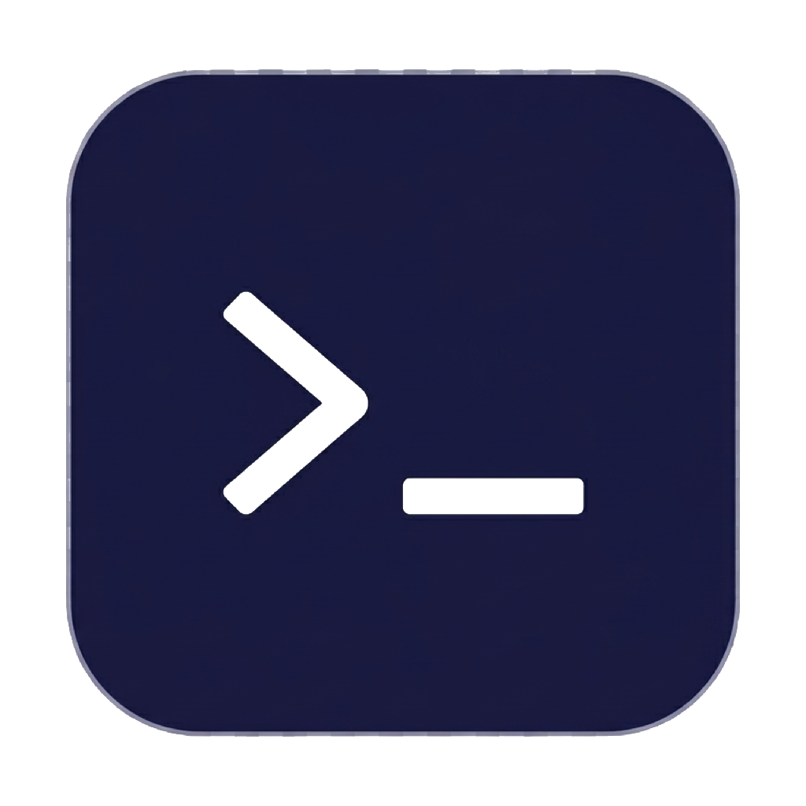

<p align="center">
  
</p>

<h1 align="center">AFKode</h1>

<p align="center">
  <strong>A fast, lightweight terminal overlay. Code anywhere.</strong>
</p>

<p align="center">
  One hotkey to summon a translucent terminal on top of anything — your game, your browser, your meeting.<br>
  Run CLI tools, vibe-code with AI agents, SSH into servers, push to prod. Then dismiss and carry on.
</p>

<p align="center">
  <a href="https://github.com/tooyipjee/afkode/releases/latest"></a>
  <a href="https://github.com/tooyipjee/afkode/releases"></a>
  <a href="./LICENSE"></a>
  
</p>

---

## Why AFKode?

You're in a game and you're dead. You're on a video call with your camera off. You're watching a build run. There's always dead time — AFKode turns it into productive time.

It's not a full IDE. It's a **zero-friction terminal** that sits on top of everything, appears instantly with a hotkey, and gets out of the way just as fast. Lightweight, snappy, no bloat.

**Use it to:**
- Vibe-code with Claude, Copilot, or any AI CLI tool
- Run quick git operations without switching windows
- SSH into servers while keeping your current app in view
- Monitor logs, run scripts, manage containers
- Dev from anywhere on any screen

## Features

| | |
|---|---|
| **Instant overlay** | Frameless, always-on-top, translucent. Appears over anything. |
| **Global hotkey** | `Cmd+\`` (macOS) / `Ctrl+\`` (Win/Linux) to toggle. `Escape` to dismiss. |
| **Tabs** | Multiple terminal sessions. `Cmd+T` / `Ctrl+Shift+T` for new tabs. |
| **Shell picker** | Choose your shell — zsh, bash, PowerShell, Git Bash, WSL, fish. |
| **Themes** | 5 built-in themes: AFKode, Dracula, Nord, One Dark, Solarized. |
| **Settings panel** | Adjust opacity, font size, theme, and default shell inline. |
| **Resizable & movable** | Drag the titlebar to move. Grab edges/corners to resize. |
| **Persisted layout** | Remembers window position, size, and preferences across sessions. |
| **System tray** | Quick access from the tray. Runs quietly in the background. |
| **Bug reports** | Built-in feedback button to report bugs or request features. |
| **Cross-platform** | macOS (Intel + Apple Silicon), Windows (x64), Linux (x64). |

## Install

### macOS / Linux

```bash
curl -fsSL https://raw.githubusercontent.com/tooyipjee/afkode/main/install.sh | sh
```

### Windows (PowerShell)

```powershell
irm https://raw.githubusercontent.com/tooyipjee/afkode/main/install.ps1 | iex
```

### Manual download

Grab the latest from [**Releases**](https://github.com/tooyipjee/afkode/releases/latest):

| Platform | File |
|---|---|
| macOS (Apple Silicon) | `AFKode-x.x.x-mac-arm64.dmg` |
| macOS (Intel) | `AFKode-x.x.x-mac-x64.dmg` |
| Windows | `AFKode-x.x.x-win-x64.exe` |
| Linux (AppImage) | `AFKode-x.x.x-linux-x86_64.AppImage` |
| Linux (Debian) | `AFKode-x.x.x-linux-amd64.deb` |

## Keyboard Shortcuts

| Shortcut | Action |
|---|---|
| `Cmd+\`` / `Ctrl+\`` | Toggle overlay |
| `Escape` | Hide overlay |
| `Cmd+T` / `Ctrl+Shift+T` | New tab |
| `Cmd+W` / `Ctrl+Shift+W` | Close tab |
| `Ctrl+Tab` | Next tab |
| `Ctrl+Shift+Tab` | Previous tab |
| `Cmd+1-9` / `Ctrl+1-9` | Jump to tab |
| `Cmd+,` / `Ctrl+,` | Open settings |

## Settings

Open the settings panel with the gear icon or `Cmd+,` / `Ctrl+,`:

- **Default shell** — pick from any shell detected on your system
- **Font size** — 8pt to 28pt stepper
- **Theme** — click a swatch to switch instantly
- **Opacity** — slide from 50% to 100% transparency

All settings persist automatically between sessions.

## Development

```bash
git clone https://github.com/tooyipjee/afkode.git
cd afkode
npm install
npm run dev
```

### Scripts

| Command | Description |
|---|---|
| `npm run dev` | Start dev server with hot reload |
| `npm run build` | Production build |
| `npm run test` | Run test suite |
| `npm run test:coverage` | Run tests with coverage report |
| `npm run dist` | Package for current platform |
| `npm run dist:mac` | Package for macOS (DMG + ZIP) |
| `npm run dist:win` | Package for Windows (NSIS installer) |
| `npm run dist:linux` | Package for Linux (AppImage + deb) |

### Tech stack

[Electron](https://www.electronjs.org/) &middot; [TypeScript](https://www.typescriptlang.org/) &middot; [xterm.js](https://xtermjs.org/) &middot; [node-pty](https://github.com/nicktaf/node-pty) &middot; [Vite](https://vite.dev/) &middot; [Vitest](https://vitest.dev/) &middot; [electron-builder](https://www.electron.build/)

## Contributing

Found a bug? Have an idea? Use the built-in feedback button in AFKode, or open an issue directly:

- [**Report a bug**](https://github.com/tooyipjee/afkode/issues/new?template=bug_report.md&labels=bug)
- [**Request a feature**](https://github.com/tooyipjee/afkode/issues/new?template=feature_request.md&labels=enhancement)

Pull requests welcome.

## License

[MIT](./LICENSE)
